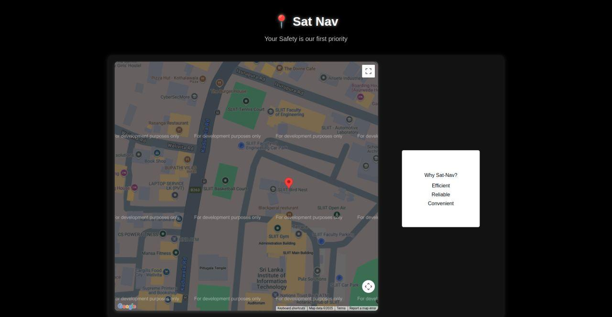
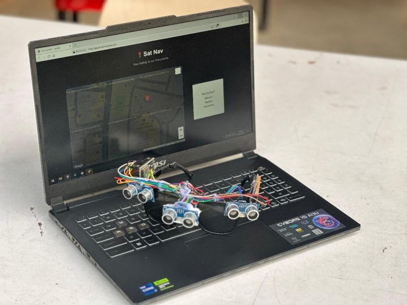

# SatNav - Real-Time GPS Tracking System

## Overview
**SatNav** is a comprehensive full-stack solution designed for real-time location tracking and monitoring. It leverages the power of the **ESP32** microcontroller and **NEO-GPS** modules to capture precise coordinates, transmitting them to a **PHP/MySQL** backend. The system culminates in a sleek, dark-themed web dashboard that visualizes location history using the **Google Maps API**, ensuring "Your Safety is our first priority."

## Features
- **Hardware Integration:** Seamless interface between ESP32 and GPS modules (NEO-6M/NEO-M8N) using the TinyGPS++ library.
- **Secure Data Transmission:** Implements API key authentication to ensure only authorized devices can post location data.
- **Real-Time Visualization:** Dynamic web interface with Google Maps integration, displaying GPS markers from the database.
- **Persistent Storage:** MySQL database backend to store and retrieve historical location data.
- **Responsive Design:** Modern, dark-mode UI optimized for both desktop and mobile viewing.
- **Testing Suite:** Includes a dedicated POST testing utility to verify backend functionality without hardware.

## Tech Stack
- **Firmware:** C++ (Arduino Framework), ESP32, TinyGPS++
- **Backend:** PHP 7.4+, MySQL
- **Frontend:** HTML5, CSS3 (Vanilla), JavaScript, Google Maps JS API
- **Communication:** RESTful HTTP POST

## Setup Instructions

### 1. Database Configuration
1. Create a MySQL database (e.g., `satnav_db`).
2. Run the following SQL command to create the tracking table:
   ```sql
   CREATE TABLE `tbl_gps` (
     `id` int(11) NOT NULL AUTO_INCREMENT,
     `lat` varchar(255) NOT NULL,
     `lng` varchar(255) NOT NULL,
     `created_date` datetime NOT NULL,
     PRIMARY KEY (`id`)
   ) ENGINE=InnoDB DEFAULT CHARSET=utf8mb4;
   ```

### 2. Backend Setup
1. Clone this repository to your web server's root directory (e.g., `htdocs` or `/var/www/html`).
2. Rename `.env.example` to `.env` (if using a loader) or update `config.php` directly:
   - Provide your `DB_HOST`, `DB_USERNAME`, `DB_PASSWORD`, and `DB_NAME`.
   - Insert your **Google Maps API Key**.
   - Set a secure **ESP32_API_KEY**.

### 3. ESP32 Firmware Setup
1. Open `ESP_32.CPP` in the Arduino IDE or VS Code (PlatformIO).
2. Install dependencies: `TinyGPS++`, `WiFi`, `HTTPClient`.
3. Update the following variables:
   - `ssid`: Your WiFi Name.
   - `password`: Your WiFi Password.
   - `SERVER_NAME`: The URL to your `gpsdata.php` endpoint.
   - `ESP32_API_KEY`: Must match the key set in `config.php`.
4. Connect the GPS module:
   - GPS TX -> ESP32 Pin 16 (RX2)
   - GPS RX -> ESP32 Pin 17 (TX2)
5. Upload the code to your ESP32.

## Usage
1. Power up the ESP32 and ensure it has a GPS fix (LED blinking on the module).
2. The device will automatically start sending coordinates to the server every 30 seconds (configurable).
3. Access `index.php` via your browser to view the live tracking map.
4. Use `post_data_test.php` to manually insert coordinates for testing purposes.

## Screenshots / Demo

*Figure 1: SatNav Dashboard showing real-time GPS markers on Google Maps.*


*Figure 2: final product.*

## Project Structure
```text
SatNav/
├── .env.example          # Environment configuration template
├── config.php            # Database and API configurations
├── ESP_32.CPP            # ESP32 Source code (Arduino/C++)
├── gpsdata.php           # API endpoint for receiving GPS data
├── index.php             # Main web dashboard with Google Maps
└── post_data_test.php    # Backend testing utility
```

## Future Improvements
- **Live Updates:** Implement WebSockets or AJAX polling for real-time map updates without refreshing.
- **Geofencing:** Add alerts when the device leaves a predefined radius.
- **Mobile App:** Develop a React Native companion app for on-the-go monitoring.
- **Data Analytics:** Add speed and altitude tracking to the dashboard.

## Author
**Gayuth**
[GitHub](https://github.com/Gayuth-W) | [Portfolio](https://your-portfolio-link.com)

---
*Note: Ensure your Google Maps API Key has "Maps JavaScript API" enabled and billing set up.*
